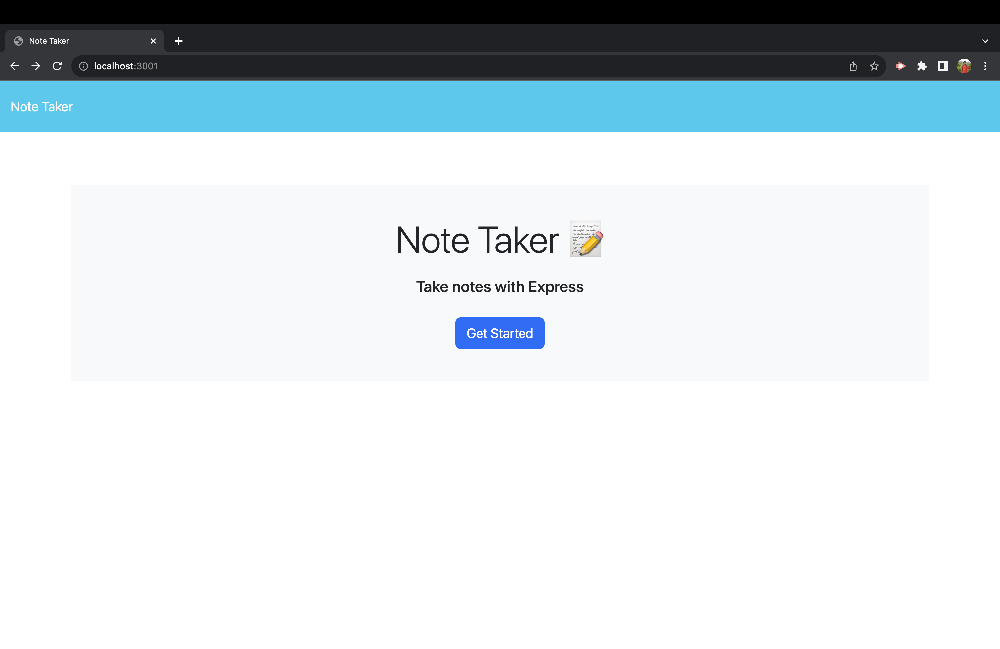
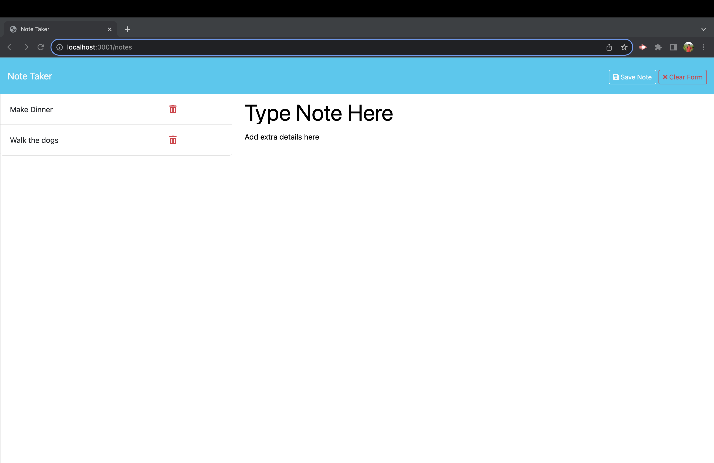

# note-taker
An application that stores notes in persistent data

## Description

This is an application that you can use to store notes and delete them when they aren't needed.  The site connects to an Express.js server and stores data in a json file.  The server has API endpoints that are used to retrieve or manipulate the data.z

## Installation

If the application is accessed at https://limitless-plateau-73449-28f3721d3414.herokuapp.com/, no installation is required.

To run the application locally, download the files from this repo and run "npm i" to install the required node packages.

## Usage

1.  Access the application using either of the two methods
    a.  Open a browser and navigate to https://limitless-plateau-73449-28f3721d3414.herokuapp.com/
    b.  Launch the application by running "node server.js", open a browser, and navigate to http://localhost.com:3001
2.  Select the "Get Started" button to be taken to the page to add and delete notes.  Refer to the screenshots below

3.  The following buttons can be used in the webpage
    - Save Note: This button saves your note and writes it to json file.  This button only appears after you have entered text in both fields for the note.
    - Clear Form: This button will clear out any text you enetered.  It only appears after you have typed in text.
    - New Note: This button will clear out the note that is currently displayed and allow the a new note to be entered
4.  Once a note is saved, it is displayed in a list on the left side of the page and its details can be obtained by selecting the note.

## Credits

The code for the web page was provided by edEx.  This is the repo where the starter code was provided: https://github.com/coding-boot-camp/miniature-eureka

## License

N/A